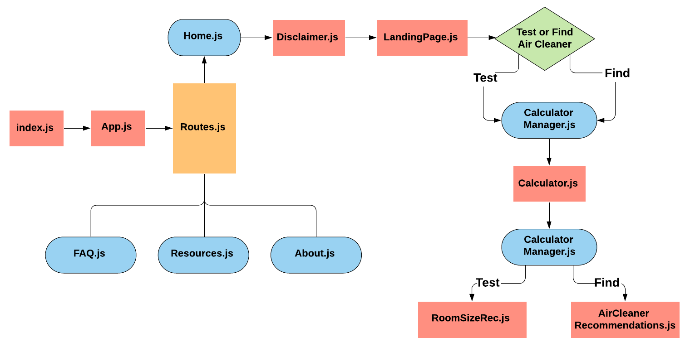

# Portable Air Cleaner Calculator

### Team Coral's Informatics Capstone Project

### Authors
* Joon Chang - UI/UX Designer
* Ryan Kobashigawa - Project Manager and UI/UX Designer
* Liam O'Keeffe - Full-stack Software Developer
* Liam Sexton - Full-stack Software Developer

## Overview
Our project is a web application that:
1. Helps small businesses find portable air cleaners that will help them to keep their employees and customers safe from COVID-19.
2. Helps small businesses who either already have a portable air cleaner or found a portable air cleaner online and want to see if their portable air cleaner will ventilate their place of business well enough to prevent the spread of COVID-19.

Our application is based on [this](https://docs.google.com/spreadsheets/d/1NEhk1IEdbEi_b3wa6gI_zNs8uBJjlSS-86d4b7bW098/edit#gid=1882881703) spreadsheet tool. The air quality calculations that we use are taken from this tool (more about these calculations below), but we have also added information not in this tool about recommended occupancy levels to try to specialize our project for small businesses. We used [this](https://www.governor.wa.gov/issues/issues/covid-19-resources/covid-19-reopening-guidance) resource from the Washington state governor's website to make our occupancy recommendations.

The application can be found [here](https://liamkokeeffe.github.io/Portable-Air-Cleaner-Calculator/#/).

### Architecture
We built our project with JavaScript and React.js.
All React components can be found in the `src/components` directory (except for the root `App.js` component which is in the `src` directory). We tried to name the components clearly and organize them into folders where it made sense.
* `src/components/LandingPage/LandingPage.js`: what the user first sees when visiting the website (initially a disclaimer, then the resulting page seen when the disclaimer its closed).
* `src/components/CalculatorManager.js`: component that is responsible for saving the state of the user inputs and passing this data between the calculator page and the results pages.
* `src/components/Calculator`: folder that contains the components used in the calculator (what a user sees when they click one of the two main buttons on the landing page after the disclaimer is closed).
* `src/components/AirCleanerRecommendations`: folder that contains the components used on the air cleaner recommendations page (what the user sees if they are using or application to find an air cleaner and click "View results" on the calculator page).
* `src/components/RoomSizeRec`: folder that contains the component used on the "Test air cleaner" information page (what the user sees if they are using our application to test the quality of an air cleaner and click "View results" on the calculator page).
* `src/components/Layout`: folder that contains the application's header and footer components, as well as a layout component which specifies how these components are organized with regard to the "body" components (whatever is between the header and footer). (Note: The `LanguageSelection` component is visually located in the header on wide screen views but it is located in the footer component in code).

 

### What air cleaners are being recommended?
Air cleaners being recommended are read from the csv file `src/air_cleaner_list.csv`. There is a [Google Sheet](https://docs.google.com/spreadsheets/d/13sPIFx85lZRDi4NUUka7anrnjawND3cdsc1KKrWKu-w/edit?usp=sharing) where the air cleaners and information about them are stored and updated. The air cleaners being recommended all have HEPA filters. When the Google Sheet changes, save the sheet as a csv file and then replace `src/air_cleaner_list.csv` with it (the change needs to be pushed to the repo to take affect). Current air cleaners were chosen from the [existing tool](https://docs.google.com/spreadsheets/d/1NEhk1IEdbEi_b3wa6gI_zNs8uBJjlSS-86d4b7bW098/edit#gid=1882881703), Consumer Lab "Which air purifiers are best for reducing the spread of COVID-19?" article, and California Government ["List of CARB-Certified Air Cleaning Devices"](https://ww2.arb.ca.gov/list-carb-certified-air-cleaning-devices) list.

### Calculations Used
**Terms Defined for the Calculations Below:**
* ACH: Air Changes Per Hour
* CADR: Clean Air Delivery Rate (units of feet<sup>3</sup>/minute)
* Room volume is either in units of feet<sup>3</sup> or meters<sup>3</sup>
* Outdoor ventilation is in units of ACH
  - Poor: 1 ACH
  - Typical: 1.5 ACH
  - Good: 3 ACH
  - Enhanced: 4 ACH
* The 60 in the below calculation is in units of minute / hour.
* The 0.58 in the below calculation is in units of (hour * feet<sup>3</sup>)/(minute * meters<sup>3</sup>)

#### Air Cleaner Calculations
When **recommending air cleaners to users**, we take the user's entered room volume and level of outdoor ventilation to estimate the ACH that each air cleaner would give their room. We only recommend air cleaners with that would give the user's space an estimated ACH of 4 or more.


**If Units are Feet:**  
Estimated ACH of user's space = ((Air Cleaner's CADR) * 60 / Room Volume) + Outdoor Ventilation  
**If Units are Meters:**  
Estimated ACH of user's space = ((Air Cleaner's CADR) / 0.58 / Room Volume) + Outdoor Ventilation

When a user is **testing the effectiveness of an air cleaner**, users enter their room volume, level of outdoor ventilation, and the CADR of their air cleaner. We then use the same calculation that we use when recommending air cleaners, but this time the CADR value is provided by the user and we therefore only need to perform the calculation once. The user is then shown the estimated ACH that their air cleaner is giving/would give their space based on their inputs.

#### Occupancy Recommendation Calculations:
We based our occupancy recommendations based off the State of Washington's Healthy Washington – [Roadmap to Recovery Plan](https://www.governor.wa.gov/issues/issues/covid-19-resources/covid-19-reopening-guidance) Guidelines. A JSON file is located at `/src/phase_date.json` which contains the phase occupancy guideline data for each activity/business.  

**Data Format:**  
```
{
  "name" : <Name of the Event>,
  "phase1Occupancy" : <Percent Occupancy at Phase 1>,
  "phase2Occupancy" : <Percent Occupancy at Phase 2>,
  "phase3Occupancy" : <Percent Occupancy at Phase 3>,
  "phase1Max" : <Max Number of People Allowed at Phase 1>,
  "phase2Max" : <Max Number of People Allowed at Phase 1>,
  "phase3Max" : <Max Number of People Allowed at Phase 1>,
}
```
First we take the phase and room type the user entered and find the corresponding recommended percent occupancy and max number of people allowed at that phase from the JSON file. Then we take their building's **max occupancy** limit and multiply that by the recommended phase **percent occupancy** (Maximum Occupancy of Room * Current Phase Percent Occupancy). We then compare that value to the max number of people allowed at that phase and recommend whichever value is **smaller**.

### Running the application locally

You will need to have `npm` installed. You can install it [here](https://www.npmjs.com/get-npm). Once npm is installed, you can run `npm install` in the project directory to install required dependencies for the project. Finally, run `npm start` to run the app. You will be able to view it at http://localhost:3000 in your browser.  

### Running tests

Run `npm test` to run all tests. We used [react-testing-library](https://testing-library.com/docs/react-testing-library/intro/) to create our tests. The tests ensure any calculations we use work as expected and also user interaction like filtering/sorting works as expected.
